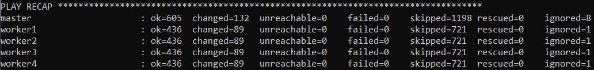

# Домашнее задание к занятию «Установка Kubernetes» - Балдин

### Цель задания

Установить кластер K8s.

### Чеклист готовности к домашнему заданию

1. Развёрнутые ВМ с ОС Ubuntu 20.04-lts.


### Инструменты и дополнительные материалы, которые пригодятся для выполнения задания

1. [Инструкция по установке kubeadm](https://kubernetes.io/docs/setup/production-environment/tools/kubeadm/create-cluster-kubeadm/).
2. [Документация kubespray](https://kubespray.io/).

-----

### Задание 1. Установить кластер k8s с 1 master node

1. Подготовка работы кластера из 5 нод: 1 мастер и 4 рабочие ноды.
2. В качестве CRI — containerd.
3. Запуск etcd производить на мастере.
4. Способ установки выбрать самостоятельно.

### Решение:

#### Создаем ВМ при помощи скрипта:

```bash
#!/bin/bash

set -e

function create_vm {
  local NAME=$1

  YC=$(cat <<END
    yc compute instance create \
      --name $NAME \
      --hostname $NAME \
      --zone ru-central1-c \
      --network-interface subnet-name=my-subnet,nat-ip-version=ipv4 \
      --memory 4 \
      --cores 2 \
      --create-boot-disk image-folder-id=standard-images,image-family=ubuntu-2004-lts,type=network-ssd,size=20 \
      --ssh-key ~/.ssh/id_rsa.pub
END
)
#  echo "$YC"
  eval "$YC"
}

create_vm "master"
create_vm "worker1"
create_vm "worker2"
create_vm "worker3"
create_vm "worker4"
```

Раскладываем публичный ключ, а еще приватный копируем на master, чтобы ansible достучался до остальных хостов.


<details>
  <summary>Установка kubespray</summary>
  
  #### Качаем kubespray

```bash
root@master:/# git clone https://github.com/kubernetes-sigs/kubespray
Cloning into 'kubespray'...
remote: Enumerating objects: 75801, done.
remote: Counting objects: 100% (663/663), done.
remote: Compressing objects: 100% (464/464), done.
remote: Total 75801 (delta 153), reused 544 (delta 100), pack-reused 75138
Receiving objects: 100% (75801/75801), 23.91 MiB | 21.10 MiB/s, done.
Resolving deltas: 100% (42641/42641), done.
```

  #### Ставим зависимости

```bash
root@master:/kubespray# pip3 install -r requirements.txt
Requirement already satisfied: ansible==2.9.6 in /usr/lib/python3/dist-packages (from -r requirements.txt (line 1)) (2.9.6)
Collecting jmespath==1.0.1
  Downloading jmespath-1.0.1-py3-none-any.whl (20 kB)
Collecting jsonschema==4.23.0
  Downloading jsonschema-4.23.0-py3-none-any.whl (88 kB)
     |████████████████████████████████| 88 kB 1.1 MB/s
Collecting netaddr==1.3.0
  Downloading netaddr-1.3.0-py3-none-any.whl (2.3 MB)
     |████████████████████████████████| 2.3 MB 8.0 MB/s
Collecting attrs>=22.2.0
  Downloading attrs-23.2.0-py3-none-any.whl (60 kB)
     |████████████████████████████████| 60 kB 12.3 MB/s
Collecting jsonschema-specifications>=2023.03.6
  Downloading jsonschema_specifications-2023.12.1-py3-none-any.whl (18 kB)
Collecting referencing>=0.28.4
  Downloading referencing-0.35.1-py3-none-any.whl (26 kB)
Collecting pkgutil-resolve-name>=1.3.10; python_version < "3.9"
  Downloading pkgutil_resolve_name-1.3.10-py3-none-any.whl (4.7 kB)
Collecting rpds-py>=0.7.1
  Downloading rpds_py-0.19.1-cp38-cp38-manylinux_2_17_x86_64.manylinux2014_x86_64.whl (355 kB)
     |████████████████████████████████| 355 kB 67.6 MB/s
Collecting importlib-resources>=1.4.0; python_version < "3.9"
  Downloading importlib_resources-6.4.0-py3-none-any.whl (38 kB)
Collecting zipp>=3.1.0; python_version < "3.10"
  Downloading zipp-3.19.2-py3-none-any.whl (9.0 kB)
Installing collected packages: jmespath, attrs, zipp, importlib-resources, rpds-py, referencing, jsonschema-specifications, pkgutil-resolve-name, jsonschema, netaddr
  Attempting uninstall: jmespath
    Found existing installation: jmespath 0.9.4
    Not uninstalling jmespath at /usr/lib/python3/dist-packages, outside environment /usr
    Can't uninstall 'jmespath'. No files were found to uninstall.
  Attempting uninstall: attrs
    Found existing installation: attrs 19.3.0
    Not uninstalling attrs at /usr/lib/python3/dist-packages, outside environment /usr
    Can't uninstall 'attrs'. No files were found to uninstall.
  Attempting uninstall: zipp
    Found existing installation: zipp 1.0.0
    Not uninstalling zipp at /usr/lib/python3/dist-packages, outside environment /usr
    Can't uninstall 'zipp'. No files were found to uninstall.
  Attempting uninstall: jsonschema
    Found existing installation: jsonschema 3.2.0
    Not uninstalling jsonschema at /usr/lib/python3/dist-packages, outside environment /usr
    Can't uninstall 'jsonschema'. No files were found to uninstall.
  Attempting uninstall: netaddr
    Found existing installation: netaddr 0.7.19
    Not uninstalling netaddr at /usr/lib/python3/dist-packages, outside environment /usr
    Can't uninstall 'netaddr'. No files were found to uninstall.
Successfully installed attrs-23.2.0 importlib-resources-6.4.0 jmespath-1.0.1 jsonschema-4.23.0 jsonschema-specifications-2023.12.1 netaddr-1.3.0 pkgutil-resolve-name-1.3.10 referencing-0.35.1 rpds-py-0.19.1 zipp-3.19.2
```
</details>

#### Файл инвентаря:

```yaml
all:
  hosts:
    master:
      ansible_host: 10.1.2.29
      ip: 10.1.2.29
      access_ip: 10.1.2.29
      ansible_user: ansible-user
    worker1:
      ansible_host: 10.1.2.10
      ip: 10.1.2.10
      access_ip: 10.1.2.10
      ansible_user: ansible-user
    worker2:
      ansible_host: 10.1.2.16
      ip: 10.1.2.16
      access_ip: 10.1.2.16
      ansible_user: ansible-user
    worker3:
      ansible_host: 10.1.2.3
      ip: 10.1.2.3
      access_ip: 10.1.2.3
      ansible_user: ansible-user
    worker4:
      ansible_host: 10.1.2.33
      ip: 10.1.2.33
      access_ip: 10.1.2.33
      ansible_user: ansible-user
  children:
    kube_control_plane:
      hosts:
        master:
    kube_node:
      hosts:
        worker1:
        worker2:
        worker3:
        worker4:
    etcd:
      hosts:
        master:
    k8s_cluster:
      children:
        kube_control_plane:
        kube_node:
    calico_rr:
      hosts: {}
```

#### Прогоняем плэйбук:



#### Вывод команды `kubectl get nodes`


## Дополнительные задания (со звёздочкой)

**Настоятельно рекомендуем выполнять все задания под звёздочкой.** Их выполнение поможет глубже разобраться в материале.   
Задания под звёздочкой необязательные к выполнению и не повлияют на получение зачёта по этому домашнему заданию. 

------
### Задание 2*. Установить HA кластер

1. Установить кластер в режиме HA.
2. Использовать нечётное количество Master-node.
3. Для cluster ip использовать keepalived или другой способ.

### Правила приёма работы

1. Домашняя работа оформляется в своем Git-репозитории в файле README.md. Выполненное домашнее задание пришлите ссылкой на .md-файл в вашем репозитории.
2. Файл README.md должен содержать скриншоты вывода необходимых команд `kubectl get nodes`, а также скриншоты результатов.
3. Репозиторий должен содержать тексты манифестов или ссылки на них в файле README.md.
